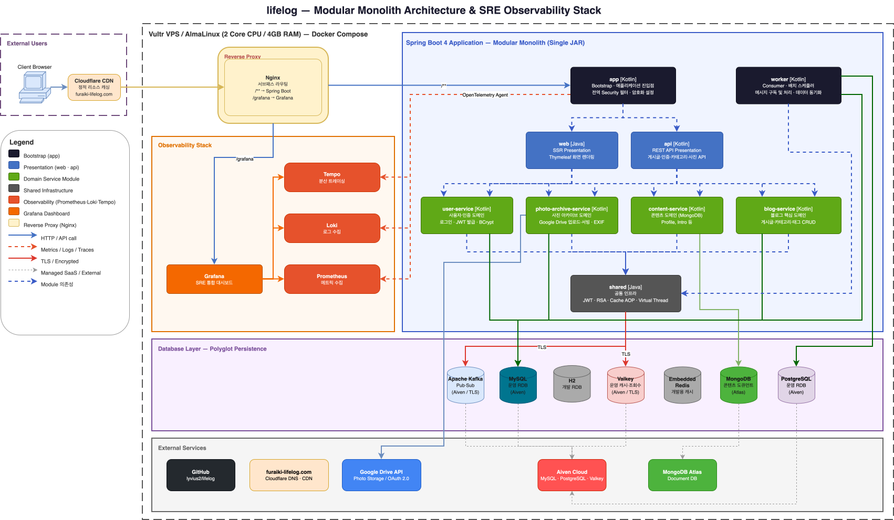

# Lifelog

> 리소스 제약 환경에서 MSA 전환을 고려하여 설계한 Modular Monolith 기반 일상 기록 개인 플랫폼

LIVE SITE : [https://furaiki-lifelog.com](https://furaiki-lifelog.com)

Spring Boot 4.0과 Kotlin/Java를 활용한 풀스택 웹 애플리케이션입니다.
RESTful API 설계, JPA 기반 데이터 모델링, Spring Security 인증을 적용했으며,
**MSA 전환을 고려한 Modular Monolith Architecture**로 설계되었습니다.

아래와 같은 **실무 문제 해결**을 목표로 설계했습니다.

- ❓ MSA를 적용하기 어려운 환경에서는 어떤 아키텍처가 적절한가?
- ❓ 다양한 데이터 특성(정형/비정형/캐시)을 어떻게 분리할 것인가?
- ❓ 운영 환경에서 장애를 어떻게 관측하고 대응할 것인가?

> **Frontend Note**: 프런트엔드(Thymeleaf 템플릿, CSS, JavaScript)는 **Vibe Coding**을 주로 활용하여 개발했습니다.
> 백엔드 아키텍처와 비즈니스 로직에 집중하되, UI/UX 구현은 AI 코딩 어시스턴트와의 협업으로 빠르게 프로토타이핑했습니다.

## 아키텍처 개요

### Modular Monolith을 선택한 이유

이 프로젝트는 포트폴리오 목적으로 클라우드 서버(Vultr, 2 Core CPU / 4GB RAM)에 배포됩니다.
제한된 인프라 스펙에서 다수의 서비스 인스턴스, 서비스 디스커버리, API Gateway 등을 운용하는 MSA를 직접 구현하기 어렵기 때문에,
단일 프로세스로 배포 가능한 Monolithic 구조를 유지하되 **도메인과 기능별로 모듈을 분리**하여 **Modular Monolith Architecture**로 전환했습니다.

이 접근 방식의 장점은 다음과 같습니다.

- **단일 배포 단위**: 하나의 JAR로 빌드·배포되므로 제한된 서버 환경에서도 운용이 가능합니다.
- **모듈 간 경계 명확화**: 각 도메인(사용자, 블로그, 콘텐츠 등)이 독립된 Gradle 모듈로 분리되어 응집도가 높고 결합도가 낮습니다.
- **MSA 전환 용이성**: 모듈 간 의존성이 명시적으로 관리되어, 향후 인프라가 확보되면 개별 모듈을 독립 서비스로 분리할 수 있습니다.
- **빌드 효율성**: 변경된 모듈만 증분 빌드되어 개발 속도가 향상됩니다.

### Lifelog System Architecture



- MSA로 확장 가능한 구조
- 제한된 서버 자원에서의 현실적인 아키텍처 선택
- Observability 기반 운영 환경 구축
- Polyglot Persistence를 통한 데이터 전략 분리

#### Key Features

##### 1. Polyglot Persistence

| 용도        | 기술               |
|-----------|------------------|
| 정형 데이터    | MySQL (JPA, 메인 앱) |
| 비정형 콘텐츠   | MongoDB          |
| 활동 로그 데이터 | PostgreSQL (JPA, worker 모듈 `posts_log`) |
| 캐시 / 조회수  | Redis (Valkey)   |

👉 데이터 성격에 따라 저장소를 분리하여 확장성과 유연성 확보. **worker**는 조회수 동기화를 위해 동일 MySQL을 **jOOQ**로 추가 접근합니다(메인 앱 JPA와 별도 `DSLContext`).

##### 2. 동적 캐시 전략 (AOP 기반)

- `@DynamicCacheable` 커스텀 어노테이션
- 메서드 단위 캐시 적용
- 캐시별 TTL 동적 설정

👉 단순 캐시가 아닌 **비즈니스 로직 기반 캐시 제어**

##### 3. 고성능 조회수 처리

- Redis `INCR` 기반 원자적 증가
- DB 부하 없이 실시간 집계

##### 4. jOOQ 기반 동적 쿼리

- 조건 기반 검색 (키워드 / 태그 / 카테고리)
- `WITH RECURSIVE` CTE 활용
- 타입 안전 쿼리 구성
- 동적 쿼리 빌더로서의 역할에만 초점을 두어, DSL 구성은 제외

##### 5. Virtual Thread 기반 병렬 처리

- Java 21 Virtual Thread 활용
- 포토 업로드, 게시글 이전/다음 조회 병렬 처리

##### 6. 외부 스토리지 연동 (Google Drive)

- 이미지 업로드 및 서빙, 썸네일 자동 생성
- Google Drive 클라이언트 인스턴스를 요청 범위 내에서 재사용 — 업로드마다 신규 생성하던 `Drive` 객체를 단일 인스턴스로 공유
- 업로드 폴더 경로 Redis 캐시 적용 (`getOrCreateFolderId`, 180분 TTL) — 동일 경로 재업로드 시 Drive API 폴더 탐색 생략
- 이미지 조회 시 파일 확장자로 MIME type 판별 → Drive metadata API 호출 제거 (요청당 Drive 왕복 1회 감소)
- Virtual Thread 병렬 업로드 안전성 확보: `file.bytes`를 사전 로드 후 독립 `ByteArrayInputStream`을 각 스레드에 전달 (스트림 이중 소비 방지)

##### 7. Observability (운영 환경 구성)

- **Prometheus**: 메트릭 수집
- **Loki**: 로그 수집
- **Tempo**: 분산 트레이싱
- **Grafana**: 통합 대시보드

##### 8. Kafka 기반 이벤트 아키텍처

- AOP(`@AfterReturning`)로 게시글 저장 후 자동 이벤트 발행
- worker 모듈에서 Kafka Consumer로 이벤트 수신 → PostgreSQL 로그 적재
- Aiven Kafka + SSL PEM 인증 (운영 환경)

##### 9. Worker 모듈 (독립 실행 JAR)

- 메인 앱과 별도로 실행되는 독립 `bootJar`
- **이중 DataSource**: MySQL은 **jOOQ `DSLContext`** + `DataSourceTransactionManager`, PostgreSQL은 **JPA**(`LocalContainerEntityManagerFactoryBean` + `JpaTransactionManager`)
- `@KafkaListener`로 게시글 저장 이벤트 → `posts_log` 적재, **스케줄러**로 Redis 조회수 → MySQL `posts.view_count` 주기 동기화, Kafka 헬스 체크 ping/pong

##### 10. 사진 좋아요(Like) 구현

- Cookie 기반 중복 방지 (24시간 쿨다운)
- RFC 6265 호환 쿠키 직렬화 (`photoSeq:timestamp` 형식, `|` 구분자)
- 클라이언트(JavaScript)/서버(`CookieHandler`) 이중 검증
- `GlobalExceptionHandler`로 중복 좋아요 시 400 응답 + 토스트 알림

##### 11. 에러 핸들링

- `GlobalExceptionHandler`(`@RestControllerAdvice`): API 예외를 `Rest<T>` 형식으로 일관된 에러 응답
- `CustomErrorController`(`@ControllerAdvice`): 404 페이지 → 5초 후 자동 리다이렉트
- API 경로(`/api`)와 페이지 경로 분리 처리

##### 12. Spring AI × OpenAI — 게시글 요약 자동 생성

- **Spring AI**(`spring-ai-openai`, `ChatClient`)로 OpenAI Chat Completions API 연동
- `shared`에 `OpenAiConfig`(`OpenAiApi`·`OpenAiChatModel`·`ChatClient` Bean), `OpenAiChatService`로 프롬프트 호출 공통화
- `PostFacade.getCreatedSummary()`에서 본문(Markdown 등)을 받아 **3줄 요약** 프롬프트로 변환
- `POST /api/post/create-summary`로 요약 텍스트 반환(`Rest<String>`), Markdown 에디터(`editor.js`)에서 요약 필드에 자동 반영


### 모듈 구조

```
lifelog/
├── app/                        ← 애플리케이션 부트스트랩 (유일한 실행 모듈)
├── web/                        ← SSR 프레젠테이션 계층 (Thymeleaf)
├── api/                        ← REST API 프레젠테이션 계층 (Swagger)
├── user-service/               ← 사용자·인증 도메인
├── blog-service/               ← 블로그(게시글·카테고리·태그) 도메인
├── content-service/            ← 콘텐츠(프로필·차량 소개 등) 도메인
├── photo-archive-service/      ← 사진 아카이브 도메인
├── worker/                     ← 독립 실행 워커 (Kafka Consumer, 이중 DB)
├── shared/                     ← 공통 유틸리티·설정
└── sre-containers/             ← SRE 모니터링 스택 (Docker Compose)
```

### 모듈 의존성

```
                         ┌──────────────────┐
                         │       app        │
                         │  (Bootstrap)     │
                         └───────┬──────────┘
                           ┌─────┴─────┐
                           ▼           ▼
                    ┌──────────┐ ┌──────────┐
                    │   web    │ │   api    │
                    │  (SSR)   │ │  (REST)  │
                    └────┬─────┘ └────┬─────┘
                         │            │
          ┌──────────────┼────────────┼──────────────┐
          ▼              ▼            ▼              ▼
  ┌──────────────┐ ┌───────────┐ ┌────────────┐ ┌────────────────────┐
  │ user-service │ │blog-service│ │content-svc │ │photo-archive-svc   │
  │  (사용자)     │ │  (블로그)  │ │ (콘텐츠)   │ │  (사진 아카이브)    │
  └──────┬───────┘ └─────┬─────┘ └─────┬──────┘ └─────────┬──────────┘
         │               │             │                   │
         ▼               ▼             ▼                   ▼
  ┌─────────────────────────────────────────────────────────────────┐
  │                          shared                                 │
  │              (공통 유틸리티·설정·어노테이션)                       │
  └──────────────────────────────▲──────────────────────────────────┘
                                 │
                                 │
                    ┌────────────┴───────────┐
                    │        worker          │
                    │  (독립 실행 Kafka       │
                    │   Consumer + 이중 DB)  │
                    └────────────────────────┘
```

> 각 도메인 서비스 모듈은 `shared`에만 의존하며, 서비스 모듈 간에는 직접 의존성이 없습니다.
> `web`과 `api`가 모든 서비스 모듈을 조합하여 프레젠테이션 계층에서 오케스트레이션합니다.
> `worker`는 독립적으로 실행되는 별도의 `bootJar`로 빌드되며, Gradle 상으로는 `shared`에 의존합니다(jOOQ 등은 `shared`를 통해 전이). Kafka로 메인 애플리케이션과 비동기로 통신합니다.

### 각 모듈의 역할

| 모듈 | 유형 | 역할 |
|------|------|------|
| **app** | Bootstrap | Spring Boot 애플리케이션 진입점. 전역 Security 필터 설정, `bootJar`를 생성하는 유일한 실행 모듈. `web`과 `api`만 의존 |
| **web** | Presentation | Thymeleaf 기반 SSR 컨트롤러. 메인 페이지, 게시글 뷰, 에디터, 프로필, 사진 갤러리, 아키텍처 등 화면 렌더링. `CustomErrorController`로 404 에러 핸들링 (API/페이지 분리, 5초 리다이렉트) |
| **api** | Presentation | REST API 컨트롤러. `AuthController`는 `user-service`의 `AuthFacade`·`AuthService`를 호출. 게시글 CRUD/검색, **AI 요약 생성**(`POST /api/post/create-summary`), 인증(RSA 공개키·로그인·토큰 갱신), 카테고리 조회, 사진 좋아요 API. `GlobalExceptionHandler`로 API 예외를 `Rest<T>` 일관 응답, `CookieHandler`로 좋아요 쿠키 검증. Swagger UI 문서화 |
| **user-service** | Domain | 사용자 엔티티·인증. **`AuthFacade`**(`@Facade`), `AuthService`(로그인·JWT·**Refresh Token**), `RefreshTokenRepository`(Redis 저장·TTL), `UserDetailsService`, BCrypt, **세션 + Access/Refresh JWT**(토큰 갱신 API). JPA `User` 엔티티 — RefreshToken은 **RDB 테이블 제거 후 Redis 전용** |
| **blog-service** | Domain | 블로그 핵심 도메인. 게시글·카테고리·태그 CRUD, jOOQ 동적 검색·페이징(재귀 CTE로 하위 카테고리 포함 검색), jOOQ bulk insert 태그 저장, MapStruct DTO 변환(default 메서드로 변환 로직 분리). `PostFacade`에서 Spring AI 연동 `OpenAiChatService`를 통한 **게시글 본문 기반 요약문 생성** |
| **content-service** | Domain | MongoDB Document 기반 콘텐츠 관리. 자기소개(PROFILE), 애차 소개(CAR) 등 타입별 콘텐츠 저장·조회 |
| **photo-archive-service** | Domain | 사진 아카이브 도메인. Google Drive 연동 이미지 업로드·서빙, 썸네일 자동 생성, EXIF 메타데이터 저장, jOOQ 동적 검색, PhotoArchiveFacade |
| **shared** | Infrastructure | 공통 유틸리티. JWT 토큰 핸들러, RSA 키 관리, Markdown 변환기, Google Drive 설정/헬퍼, **Spring AI(OpenAI ChatClient)** 설정(`OpenAiConfig`)·호출 서비스(`OpenAiChatService`), jOOQ 공통 설정, AsyncSupporter, PageResponse, @Facade, @DynamicCacheable, ViewCountHelper, Redis 캐시 설정, Kafka Producer 설정, 공통 예외 |
| **sre-containers** | DevOps | Docker Compose 기반 SRE 모니터링 스택. Grafana(대시보드)·Prometheus(메트릭)·Loki(로그)·Tempo(트레이싱) 컨테이너를 한 번에 실행하여 애플리케이션 Observability 확보 |
| **worker** | Independent App | 독립 실행 Kafka Consumer 워커. `PostsLogConsumer`로 이벤트 수신 → PostgreSQL `posts_log`(JPA, `event.entity`·`event.repository`). MySQL은 jOOQ(`PostsQueryRepository`)로 발행 글 조회·`view_count` 갱신, `PostViewCountSyncService`가 Redis → MySQL 동기화. `DatabaseBeanObjectCreator`, `MysqlJooqConfig`, `PostgresJpaConfig`. `logback-spring.xml`로 프로파일별 로깅 |

## 주요 기능

- **게시글 관리**: CRUD 및 ID/Slug 기반 조회, Markdown 원본 보존
- **AI 요약(Spring AI + OpenAI)**: 게시글 본문을 기반으로 OpenAI Chat API를 호출해 **간결한 3줄 요약**을 생성하고, 에디터에서 요약(summary) 입력란에 바로 넣을 수 있음(`POST /api/post/create-summary`, Swagger 문서화)
- **게시글 검색·페이징**: jOOQ 기반 동적 쿼리로 키워드·카테고리·태그·상태 필터링 및 페이징 조회. 카테고리 검색 시 `WITH RECURSIVE` CTE로 하위 카테고리 게시글까지 포함 조회
- **Markdown 에디터**: Commonmark 기반 Markdown → HTML 변환, 에디터 UI에서 카테고리·태그 입력 지원, 게시일자 직접 지정 가능
- **관리자 인증**: Spring Security + 세션/JWT 이중 인증, BCrypt, RSA 비밀번호 암호화. **Access Token**·**Refresh Token** 발급, 토큰 갱신 API. Refresh Token은 **Redis**에 저장(TTL 만료) — JPA `RefreshToken` 엔티티 제거. `AuthFacade`·`AuthService`는 **`user-service`**에 위치하고, `api`의 `AuthController`가 이를 호출
- **카테고리 시스템**: 계층 구조(Self-referencing) 카테고리, 최대 3 depth 트리 조회, 인덱스 페이지 동적 카테고리 렌더링
- **태그 시스템**: 게시글에 태그를 부여하는 다대다(M:N) 관계, 태그 클릭 시 해당 태그 검색 결과 링크, 검색 결과에서 현재 태그 bold 하이라이팅, jOOQ bulk insert로 태그 일괄 저장
- **콘텐츠 관리**: MongoDB Document 기반 유연한 콘텐츠 저장 (자기소개, 애차 소개 등)
- **사진 아카이브**: Google Drive 연동 이미지 업로드·서빙, 600px 썸네일 자동 생성, 클라이언트 EXIF 추출(exifr) 및 서버 메타데이터 저장, jOOQ 동적 검색·페이징, 카테고리별 분류, Valkey/Redis 캐시로 Drive API 호출 최소화, 모바일/태블릿 라이트박스 UX 최적화(캡션/태그 상시 표시, 메타정보 토글, 세로 사진 전체 표시)
- **사진 좋아요(Like) 시스템**: Cookie 기반 중복 방지 좋아요 기능. 24시간 쿨다운, RFC 6265 호환 쿠키 직렬화(`|` 구분자), 클라이언트/서버 이중 검증, 토스트 알림 UX
- **Valkey/Redis 캐시 확대 적용**: Google Drive 폴더/파일 ID 캐싱뿐 아니라, 블로그 카테고리 트리(15분 TTL), MongoDB 콘텐츠(5분 TTL), **게시글 단건 조회(본문·태그 등, 24시간 TTL)** , 이미지·프록시 응답 **캐시 정책(예: 7일)** , 블로그 게시글 조회수까지 Valkey/Redis를 활용. `@DynamicCacheable` + `@Aspect`로 메서드 단위 캐시, 캐시 Evict 시 **null 방어** 처리. `DynamicRedisCacheManager`로 캐시별 TTL 동적 관리
- **블로그 게시글 조회수 관리**: Valkey/Redis의 `INCR` 커맨드로 게시글 조회수를 원자적으로 관리. RDB 부하 없이 실시간 조회수 집계, 서버 재시작 시에도 조회수 유지. 인덱스 페이지 및 게시글 목록에서 조회수 표시
- **관리자 전용 보안**: Spring Security로 에디터·업로드·Google Auth 경로 인증 보호, 비인가 접근 시 access-denied 페이지, 세션 기반 로그아웃
- **에러 핸들링**: `GlobalExceptionHandler`(`@RestControllerAdvice`)로 API 예외를 `Rest<T>` 형식의 일관된 에러 응답으로 처리, `CustomErrorController`(`@ControllerAdvice`)로 404 Not Found 시 안내 페이지 렌더링 및 5초 후 자동 리다이렉트
- **SSR 페이지**: Thymeleaf 템플릿 기반 서버 사이드 렌더링
- **레이아웃 데코레이터 패턴**: Thymeleaf Layout Dialect로 공통 nav/footer 분리
- **반응형 UI**: 네비게이션, 푸터 포함 모바일/데스크톱 대응
- **Facade 패턴**: Controller → Facade → Service 구조로 비즈니스 오케스트레이션 분리 (PostFacade, AuthFacade, PhotoArchiveFacade)
- **Virtual Thread**: Java 21 Virtual Thread로 비동기 병렬 처리 (`AsyncSupporter` 공통 유틸리티). **이전/다음 게시글**은 **`publishedAt`(발행 시각) 기준**으로 조회, 게시글+태그 저장·업로드 병렬화 등에 활용
- **Polyglot Persistence**: RDB(MySQL/H2), PostgreSQL(worker 로그), MongoDB, Valkey/Redis를 함께 사용하는 다중 데이터 소스 구성
- **DB 접속 정보 암호화**: Jasypt(PBEWithMD5AndDES)로 MySQL·MongoDB·Redis 접속 정보 암호화
- **Observability**: Prometheus 메트릭 수집, Loki 로그 수집, OpenTelemetry 분산 트레이싱, Logback 프로파일별 로깅 전략
- **공통 API 응답 형식**: `Rest<T>` 제네릭 래퍼로 일관된 JSON 응답 구조
- **Kafka 이벤트 아키텍처**: `PostSaveEventAspect`가 저장 직후 **`PostUpdatedMessage`** DTO로 Kafka 발행(불필요한 DB 재조회 제거 등 성능 개선). worker가 수신해 PostgreSQL `posts_log` 적재
- **Worker 모듈**: 독립 실행 `bootJar`. Kafka로 활동 로그 적재(PostgreSQL·JPA), MySQL은 **jOOQ**로 조회수 동기화 등 배치 처리. 이중 DataSource·이중 트랜잭션 매니저(`DataSourceTransactionManager` + `JpaTransactionManager`)
- **API 문서화**: Swagger UI 자동 생성

## 기술 스택

| 구분 | 기술 |
|------|------|
| **Language** | Kotlin 2.2.21, Java 21 |
| **Framework** | Spring Boot 4.0.2 |
| **Architecture** | Multi-Module Modular Monolith (Gradle) |
| **Security** | Spring Security (세션 + JWT 이중 인증, BCrypt, RSA 비밀번호 암호화) |
| **JWT** | JJWT 0.12.6 (Access Token 생성/검증, HMAC-SHA256 서명) |
| **ORM** | Spring Data JPA, Hibernate |
| **Query Builder** | jOOQ (blog-service·photo-archive-service: 동적 검색·페이징, **worker**: 발행 글·조회수 동기화) |
| **Document DB** | MongoDB (콘텐츠 도큐먼트 저장, Spring Data MongoDB) |
| **Cache** | Valkey/Redis (Spring Data Redis, Spring Cache 추상화, `@DynamicCacheable` + `@Aspect` AOP, `DynamicRedisCacheManager`, `RedisSerializer.json()`, 역직렬화 실패 자동 복구) |
| **Template Engine** | Thymeleaf (SSR) + Thymeleaf Layout Dialect (Decorator Pattern) |
| **Client Libraries** | Vanilla JS, Prism.js (코드 하이라이팅), exifr (클라이언트 EXIF 추출) |
| **Markdown** | Commonmark 0.24.0 (GFM Tables, Strikethrough, Autolink, Heading Anchor, Task List) |
| **Database** | H2 (개발 RDB), MySQL (운영 RDB), PostgreSQL (worker `posts_log`), MongoDB (콘텐츠 도큐먼트), Valkey/Redis (캐시·조회수) |
| **Build Tool** | Gradle 9.3.0 (Kotlin DSL, Multi-Module) |
| **API Documentation** | Springdoc OpenAPI 2.7.0 (Swagger) |
| **Object Mapping** | MapStruct 1.6.3 |
| **External Storage** | Google Drive API v3 (OAuth 2.0, 이미지 업로드·서빙·썸네일 생성) |
| **Concurrency** | Java 21 Virtual Thread, AsyncSupporter (CompletableFuture 래퍼) |
| **Message Queue** | Apache Kafka (Aiven Cloud, SSL PEM 인증), Spring Kafka (`@KafkaListener`, `KafkaTemplate`) |
| **AI / LLM** | Spring AI 2.0.0-M3 (`spring-ai-openai`, `spring-ai-starter-model-openai`), OpenAI Chat Completions API (`ChatClient`, `OpenAiChatModel`) |
| **Encryption** | Jasypt 3.0.5 (PBEWithMD5AndDES, DB 접속 정보 암호화) |
| **Observability** | Micrometer Prometheus (메트릭), Loki4j (로그 수집), OpenTelemetry (분산 트레이싱) |
| **Logging** | Logback (프로파일별 전략: 콘솔/파일/Loki, 에러 로그 분리, 30일 보관) |
| **Monitoring** | Spring Boot Actuator (health, info, prometheus, metrics) |

## 레이어드 아키텍처

각 모듈은 레이어드 아키텍처를 따르며, 모듈 간 통신은 직접 메서드 호출로 이루어집니다.

```
┌─────────────────────────────────────────────────────────────────────────────┐
│                         Presentation Layer                                  │
│                                                                             │
│  ┌─ web module ──────────────────────┐  ┌─ api module ────────────────────┐ │
│  │ RenderingController  (SSR Pages)  │  │ PostController     (REST API)  │ │
│  │ ContentController    (SSR Pages)  │  │ AuthController     (REST API)  │ │
│  │ PostViewController   (SSR Editor) │  │ PhotoController    (REST API)  │ │
│  │ CustomErrorController (404)       │  │ GlobalExceptionHandler         │ │
│  └───────────────────────────────────┘  │ CookieHandler, SwaggerConfig   │ │
│                                         │ Rest<T> (Auth는 user-service     │ │
│                                         │  AuthFacade 연동)                │ │
│                                         └────────────────────────────────┘ │
└──────────────┬──────────────────────────────────────┬──────────────────────┘
               │                                      │
┌──────────────┼──────────────────────────────────────┼──────────────────────┐
│              ▼              Facade Layer             ▼                      │
│  ┌─ blog-service ─────────────────────────────────────────────────────┐    │
│  │  PostFacade (@Facade)                                              │    │
│  │  - 게시글 조회·저장 오케스트레이션                                    │    │
│  │  - 에디터 데이터 조합 (카테고리 + 게시글 + 태그)                     │    │
│  │  - Virtual Thread로 이전/다음 글 병렬 조회                          │    │
│  │  - Spring AI(OpenAiChatService)로 본문 요약문 생성                  │    │
│  └────────────────────────────────────────────────────────────────────┘    │
└───────────────────────────────────────────────────────────────────────────-┘
               │
┌──────────────┼────────────────────────────────────────────────────────────-┐
│              ▼              Business Layer (Domain Modules)                 │
│                                                                             │
│  ┌─ blog-service ────────────┐  ┌─ user-service ───────┐  ┌─ content-service ──┐ │
│  │ PostService         (CRUD) │  │ AuthFacade (@Facade) │  │ ContentService     │ │
│  │ CategoryService            │  │ AuthService (JWT·     │  │  (MongoDB 콘텐츠)  │ │
│  │ PostTagService             │  │  RefreshToken·Redis) │  │ MongoConfig        │ │
│  │ PostsQueryRepository(jOOQ) │  │ UserService,         │  └────────────────────┘ │
│  │ PostTagsQueryRepository    │  │ CustomUserDetails,    │                         │
│  │ PostMapper, CategoryMapper │  │ SecurityConfig,       │                         │
│  └────────────────────────────┘  │ UserMapper            │                         │
│                                  └──────────────────────┘                          │
│                                                                                    │
│  ┌─ photo-archive-service ──────────────────────────────────────────────────────┐ │
│  │ PhotoArchiveFacade (@Facade) │ GoogleDriveService │ PhotoService             │ │
│  │ PhotosQueryRepository (jOOQ) │ PhotoMapper, PhotoCategoryMapper             │ │
│  └──────────────────────────────────────────────────────────────────────────────┘ │
│                                                                                    │
│  ┌─ shared ─────────────────────────────────────────────────────────────────────┐ │
│  │ AccessTokenHandler (JWT)  │ RsaKeyHolder (RSA)    │ GoogleDriveConfig/Helper │ │
│  │ MarkdownConverter (MD→HTML) │ AsyncSupporter │ JooqConfig │ PageResponse     │ │
│  │ VirtualThreadConfig │ @Facade │ @DynamicCacheable │ ViewCountHelper          │ │
│  │ RedisCacheConfig │ DynamicCacheableInterceptor (@Aspect) │ DynamicRedisCacheManager │ │
│  │ JacksonConfig │ OpenAiConfig · OpenAiChatService │ KafkaTopics │ MessageQueueConfig   │ │
│  └───────────────────────────────────────────────────────────────────────────────┘ │
└───────────────────────────────────────────────────────────────────────────-┘
               │
┌──────────────┼────────────────────────────────────────────────────────────-┐
│              ▼           Event / Messaging Layer                           │
│                                                                             │
│  ┌─ blog-service (Publisher) ───────────────────────────────────────────┐  │
│  │ PostSaveEventAspect (@AfterReturning)                                │  │
│  │ → PostFacade.savePost() 후 Kafka 발행 (`PostUpdatedMessage` DTO)     │  │
│  └──────────────────────────────┬───────────────────────────────────────┘  │
│                                 │  Kafka (lifelog.post.updated)            │
│  ┌─ worker (Consumer / 스케줄) ───┼───────────────────────────────────────┐  │
│  │ PostsLogConsumer → PostgreSQL posts_log (JPA, event.* 패키지)         │  │
│  │ PostViewCountSyncService + PostsQueryRepository (MySQL jOOQ + Redis)  │  │
│  │ KafkaConsumerConfig, MysqlJooqConfig, PostgresJpaConfig                │  │
│  └────────────────────────────────────────────────────────────────────────┘  │
└───────────────────────────────────────────────────────────────────────────-┘
               │
┌──────────────┼────────────────────────────────────────────────────────────-┐
│              ▼              Data Access Layer                               │
│  ┌────────────────────┐  ┌──────────────────────┐  ┌──────────────────────┐ │
│  │PostsRepository     │  │UserRepository        │  │ContentDocumentRepo   │ │
│  │PostTagsRepository  │  │                      │  │ (MongoRepository)    │ │
│  │CategoriesRepository│  │                      │  │                      │ │
│  └────────┬───────────┘  └────────┬─────────────┘  └────────┬─────────────┘ │
└───────────┼───────────────────────┼──────────────────────────┼──────────────┘
            │                       │                          │
┌───────────┼───────────────────────┼──────────────────────────┼──────────────┐
│           ▼                       ▼                          ▼              │
│                             Database Layer                                       │
│  ┌────────────────────────────┐ ┌───────────────────┐ ┌───────────────────────┐ │
│  │ H2 (개발) / MySQL (운영)  │ │     MongoDB       │ │ Embedded Redis (개발) │ │
│  │ users, posts, categories, │ │ content-documents  │ │ Valkey SaaS (운영)    │ │
│  │ posts_tags, photos, ...   │ │                    │ │ 캐시, 조회수 관리     │ │
│  └────────────────────────────┘ └───────────────────┘ └───────────────────────┘ │
│  ┌────────────────────────────┐                                                 │
│  │ PostgreSQL (worker 전용)   │                                                 │
│  │ posts_log (활동 로그)      │                                                 │
│  └────────────────────────────┘                                                 │
└─────────────────────────────────────────────────────────────────────────────────┘

┌─────────────────────────────────────────────────────────────────────────────┐
│                        Template Layer (Thymeleaf)                            │
│  ┌──────────────┐  ┌─────────────────┐  ┌──────────────────────────────┐   │
│  │layout/       │  │fragments/       │  │ Pages                        │   │
│  │ default.html │  │ navigation.html │  │ index, profile, post,        │   │
│  │ (base layout │◄─┤ footer.html     │  │ post-list, my-car, photos,   │   │
│  │  + 로그인 모달)│  └─────────────────┘  │ sre, architecture,           │   │
│  └──────────────┘                        │ not-found, access-denied     │   │
│                                          │ (layout:decorate 적용)       │   │
│                                          ├──────────────────────────────┤   │
│                                          │ editor, photo-upload         │   │
│                                          │ (독립 Standalone)            │   │
│                                          └──────────────────────────────┘   │
└─────────────────────────────────────────────────────────────────────────────┘
```

## 프로젝트 구조

```
lifelog/
├── build.gradle.kts                   # 루트: 플러그인 버전 관리 + subprojects 공통 설정
├── settings.gradle.kts                # 모듈 include 선언
│
├── app/                               # [Bootstrap Module]
│   ├── src/main/kotlin/
│   │   └── com/walter/lifelog/
│   │       ├── LifelogApplication.kt  #   Spring Boot 메인 클래스
│   │       └── config/
│   │           ├── FilterConfig.kt        #   전역 Security 필터 (인증 경로 보호, 로그아웃)
│   │           └── JasyptConfig.kt        #   Jasypt DB 접속 정보 암호화 설정
│   └── src/main/resources/
│       ├── application.yml            #   기본(H2+MongoDB+EmbeddedRedis) 프로필 설정
│       ├── application-live.yml       #   운영(MySQL+MongoDB+Valkey) 프로필 설정
│       └── logback-spring.xml         #   프로파일별 로깅 (콘솔/파일/Loki)
│
├── web/                               # [Web Presentation Module]
│   └── src/main/java/
│       └── com/walter/lifelog/web/
│           ├── controller/
│           │   ├── ContentController.java         # 콘텐츠 SSR (profile, my-car, access-denied)
│           │   ├── CustomErrorController.java     # 404 에러 핸들링 (API/페이지 분리, 5초 리다이렉트)
│           │   ├── GoogleAuthController.java      # Google OAuth 2.0 인증 콜백
│           │   ├── PhotoArchiveController.java    # 사진 갤러리·업로드 SSR
│           │   ├── PhotoViewController.java       # Google Drive 이미지 서빙
│           │   ├── PostViewController.java        # 게시글 상세·에디터·목록 SSR
│           │   └── SreViewController.java         # SRE 대시보드 SSR
│           └── util/
│               └── RedirectUrlBuilder.java        # 리다이렉트 URL 생성 유틸
│
├── api/                               # [API Presentation Module]
│   └── src/main/kotlin/
│       └── com/walter/lifelog/api/
│           ├── config/
│           │   ├── SwaggerConfig.kt       # OpenAPI/Swagger 설정
│           │   └── GlobalExceptionHandler.kt  # @RestControllerAdvice 글로벌 예외 핸들링
│           ├── controller/
│           │   ├── AuthController.kt      # 인증 REST API (로그인, RSA 공개키)
│           │   ├── PostController.kt      # 게시글 REST API (조회, 검색, 저장, AI 요약, 카테고리 트리)
│           │   ├── PhotoController.kt     # 사진 REST API (조회, 업로드, 카테고리, 좋아요)
│           │   └── dto/
│           │       ├── Rest.kt            # 공통 API 응답 래퍼
│           │       └── PublicKeyResponse.kt  # RSA 공개키 응답 DTO
│           └── util/
│               └── CookieHandler.kt      # 사진 좋아요 쿠키 검증 (24시간 쿨다운, RFC 6265)
│
├── user-service/                      # [User Domain Module]
│   └── src/main/kotlin/
│       └── com/walter/lifelog/user/
│           ├── config/
│           │   └── SecurityConfig.kt      # AuthenticationManager, BCrypt 설정
│           ├── entity/
│           │   └── User.kt               # 사용자 엔티티
│           ├── dto/
│           │   ├── LoginRequest.kt
│           │   ├── LoginResponse.kt      # accessToken, refreshToken(필요 시)
│           │   ├── LoginStatusResponse.kt
│           │   └── Author.kt
│           ├── facade/
│           │   └── AuthFacade.kt          # 인증 오케스트레이션 (@Facade) — api의 AuthController가 사용
│           ├── mapper/
│           │   └── UserMapper.kt          # MapStruct: User → Author 변환
│           ├── repository/
│           │   ├── UserRepository.kt
│           │   └── RefreshTokenRepository.kt  # Redis String — Refresh Token 저장·검증·TTL
│           └── service/
│               ├── AuthService.kt             # 로그인, JWT·RefreshToken 발급/갱신/폐기
│               ├── CustomUserDetailsService.kt # Spring Security UserDetails
│               └── UserService.kt             # 사용자 조회
│
├── blog-service/                      # [Blog Domain Module]
│   └── src/main/kotlin/
│       └── com/walter/lifelog/blog/
│           ├── entity/
│           │   ├── Post.kt                # 게시글 엔티티
│           │   ├── Category.kt            # 카테고리 엔티티 (계층 구조)
│           │   ├── PostTag.kt             # 게시글-태그 M:N 엔티티
│           │   └── code/
│           │       └── PostStatus.kt      # DRAFT / PUBLISHED / ARCHIVED
│           ├── dto/
│           │   ├── PostRequest.kt
│           │   ├── PostResponse.kt
│           │   ├── PostSaveResponse.kt
│           │   ├── PostListResponse.kt    # 게시글 목록 DTO
│           │   ├── PostSearchCondition.kt # 검색 조건 (키워드, 카테고리, 태그, 상태, 페이징)
│           │   ├── PageResponse.kt        # 페이징 응답 래퍼
│           │   ├── PostCategory.kt
│           │   └── CategoryTreeResponse.kt
│           ├── facade/
│           │   └── PostFacade.kt          # 비즈니스 오케스트레이션 (@Facade)
│           ├── event/
│           │   └── PostSaveEventAspect.kt # @AfterReturning: 저장 후 Kafka (`PostUpdatedMessage`)
│           ├── mapper/
│           │   ├── PostMapper.kt          # MapStruct: Post ↔ DTO
│           │   └── CategoryMapper.kt      # MapStruct: Category → DTO
│           ├── repository/
│           │   ├── PostsRepository.kt     # JPA Repository
│           │   ├── PostsQueryRepository.kt  # jOOQ 동적 쿼리 (검색·페이징, 재귀 CTE 카테고리)
│           │   ├── PostTagsQueryRepository.kt # jOOQ 태그 bulk insert·삭제
│           │   ├── CategoriesRepository.kt
│           │   └── PostTagsRepository.kt
│           └── service/
│               ├── PostService.kt         # 게시글 CRUD
│               ├── CategoryService.kt     # 카테고리 트리 조회
│               └── PostTagService.kt      # 태그 관리
│
├── content-service/                   # [Content Domain Module — MongoDB]
│   └── src/main/kotlin/
│       └── com/walter/lifelog/content/
│           ├── config/
│           │   └── MongoConfig.kt         # MongoDB Auditing 설정
│           ├── entity/
│           │   ├── ContentDocuments.kt    # MongoDB Document 엔티티
│           │   └── code/
│           │       └── ContentType.kt     # INTRO / PROFILE / CAR
│           ├── repository/
│           │   └── ContentDocumentRepository.kt  # MongoRepository
│           └── service/
│               └── ContentService.kt      # 타입별 콘텐츠 조회
│
├── photo-archive-service/             # [Photo Archive Domain Module]
│   └── src/main/kotlin/
│       └── com/walter/lifelog/photo/
│           ├── entity/
│           │   ├── Photo.kt               # 사진 엔티티 (EXIF, GPS, 썸네일 등)
│           │   ├── PhotoCategory.kt       # 사진 카테고리 엔티티
│           │   └── PhotoTag.kt            # 사진-태그 M:N 엔티티
│           ├── dto/
│           │   ├── UploadRequest.kt       # 업로드 요청 (메타데이터 + EXIF)
│           │   ├── UploadResponse.kt      # 업로드 결과 (Drive 경로·링크)
│           │   ├── PhotoSearchRequest.kt  # 사진 검색 요청 (카테고리, 페이징)
│           │   ├── PhotoSearchResponse.kt # 사진 검색 결과 (EXIF, 촬영자 등)
│           │   ├── PhotoCategoryResponse.kt # 카테고리 응답
│           │   ├── PhotoLikeCountResponse.kt # 좋아요 수 응답
│           │   ├── ExifInfo.kt            # EXIF 정보 DTO
│           │   └── ImageResource.kt       # 이미지 리소스 (InputStream + MIME)
│           ├── facade/
│           │   └── PhotoArchiveFacade.kt  # 사진 업로드·조회 오케스트레이션 (@Facade)
│           ├── mapper/
│           │   ├── PhotoMapper.kt         # MapStruct: UploadRequest → Photo
│           │   └── PhotoCategoryMapper.kt # MapStruct: PhotoCategory → DTO
│           ├── repository/
│           │   ├── PhotosRepository.kt    # JPA Repository
│           │   ├── PostsQueryRepository.kt  # jOOQ 동적 쿼리 (검색·페이징, 재귀 CTE 카테고리)
│           │   ├── PhotoCategoriesRepository.kt
│           │   └── PhotoTagsRepository.kt
│           └── service/
│               ├── GoogleDriveService.kt  # Google Drive 업로드·이미지 서빙
│               └── PhotoService.kt        # 사진 검색·카테고리 조회
│
└── shared/                            # [Shared Infrastructure Module]
    ├── src/main/java/
    │   └── com/walter/lifelog/shared/
    │       ├── annotation/
    │       │   ├── Facade.java            # @Facade 커스텀 어노테이션
    │       │   └── DynamicCacheable.java  # @DynamicCacheable 캐시 어노테이션 (value, key, ttlMinutes)
    │       ├── config/
    │       │   ├── VirtualThreadConfig.java   # Virtual Thread TaskExecutor
    │       │   ├── EmbeddedRedisConfig.java   # 비운영 프로필 Embedded Redis (@Profile("!live"))
    │       │   ├── GoogleDriveConfig.java     # Google Drive OAuth 2.0 설정
    │       │   ├── JooqConfig.java            # jOOQ 공통 설정 (실행 로깅, 포매팅)
    │       │   ├── RedisCacheConfig.java      # Redis 캐시 매니저 설정
    │       │   ├── cache/
    │       │   │   ├── DynamicCacheableInterceptor.java  # @Aspect 기반 캐시 AOP (@Around)
    │       │   │   ├── DynamicRedisCacheManager.java     # 캐시별 TTL 동적 할당 CacheManager
    │       │   │   ├── DynamicCacheRegistry.java         # 캐시명-TTL 레지스트리
    │       │   │   └── DynamicCacheableScanner.java      # Bean 초기화 시 캐시 메타 스캔
    │       │   ├── messaging/
    │       │   │   ├── KafkaTopics.java                  # Kafka 토픽 상수 정의
    │       │   │   ├── MessageQueueConfig.java           # Kafka Producer + Admin + 토픽 설정
    │       │   │   └── PostUpdatedMessage.java           # 게시글 저장 후 Kafka 페이로드 DTO
    │       │   ├── JacksonConfig.java             # ObjectMapper Bean (JavaTimeModule)
    │       │   ├── OpenAiConfig.java              # OpenAiApi / OpenAiChatModel / ChatClient Bean
    │       │   └── exception/
    │       │       └── PostNotFoundException.java
    │       ├── paging/
    │       │   └── PageResponse.java          # 공통 페이징 응답 DTO (record)
    │       ├── service/
    │       │   ├── OpenAiChatService.java    # ChatClient 기반 OpenAI 호출
    │       │   └── dto/
    │       │       └── AiChatRequest.java     # system/user 메시지 DTO
    │       └── util/
    │           ├── AccessTokenHandler.java    # JWT 토큰 생성/검증
    │           ├── RsaKeyHolder.java          # RSA 2048 키 쌍 관리·암복호화
    │           ├── MarkdownConverter.java      # Markdown → HTML 변환
    │           ├── GoogleDriveHelper.java     # Google Drive 파일 업로드·조회·썸네일 생성
    │           ├── AsyncSupporter.java        # CompletableFuture 비동기 래퍼
    │           └── ViewCountHelper.java       # Redis INCR 기반 조회수 관리
    └── src/main/resources/
        └── credential.json            # Google Drive OAuth 2.0 인증 정보 (.gitignore)

├── worker/                            # [Worker Module — 독립 실행 Kafka Consumer]
│   ├── src/main/kotlin/
│   │   └── com/walter/lifelog/worker/
│   │       ├── WorkerApplication.kt       # 독립 bootJar, @EnableScheduling, 이중 DB 자동구성 제외
│   │       ├── config/
│   │       │   ├── DatabaseProperties.kt          # DataSource 공통 프로퍼티 인터페이스
│   │       │   ├── JpaProperties.kt               # PostgreSQL 쪽 JPA 옵션 인터페이스
│   │       │   ├── KafkaConsumerConfig.kt         # Kafka Consumer (SSL PEM 등)
│   │       │   ├── mysql/
│   │       │   │   ├── MysqlDatabaseProperties.kt # MySQL 접속 (@ConfigurationProperties)
│   │       │   │   └── MysqlJooqConfig.kt         # mysqlDataSource, mysqlDslContext(jOOQ), @Primary JDBC TX
│   │       │   └── postgresql/
│   │       │       ├── PostgresDatabaseProperties.kt
│   │       │       ├── PostgresJpaProperties.kt
│   │       │       └── PostgresJpaConfig.kt       # PostgreSQL DS + EMF + JpaTransactionManager + SSL 옵션
│   │       ├── consume/
│   │       │   └── PostsLogConsumer.kt            # @KafkaListener: 이벤트 JSON → PostLog 저장
│   │       ├── event/                              # PostgreSQL JPA 전용 패키지 (EnableJpaRepositories 대상)
│   │       │   ├── entity/
│   │       │   │   └── PostLog.kt                # posts_log 엔티티
│   │       │   └── repository/
│   │       │       └── PostsLogRepository.kt     # JpaRepository (PostgreSQL 영속성 컨텍스트)
│   │       ├── sync/
│   │       │   ├── repository/
│   │       │   │   └── PostsQueryRepository.kt   # jOOQ: PUBLISHED 글 목록, Redis→MySQL view_count 반영
│   │       │   └── service/
│   │       │       └── PostViewCountSyncService.kt # @Scheduled cron: 조회수 배치 동기화(Virtual Thread)
│   │       └── util/
│   │           └── DatabaseBeanObjectCreator.kt   # Hikari + EntityManagerFactory 빌더
│   ├── src/test/kotlin/...                        # PostsQueryRepositoryTest, PostViewCountSyncServiceTest
│   └── src/main/resources/
│       ├── application.yml                        # worker 전용 (이중 DB, Kafka, Redis, port 등)
│       └── logback-spring.xml                     # 프로파일별 로그(콘솔·파일·레벨)

sre-containers/                        # SRE 모니터링 스택 (Docker Compose)
├── docker-compose.yml                 # Grafana + Prometheus + Loki + Tempo 컨테이너 정의
├── prometheus/
│   └── config/prometheus.yml          # Prometheus 스크래핑 설정 (lifelog /actuator/prometheus, 5초 주기)
├── loki/
│   └── config/loki-config.yml         # Loki 로그 수집·저장 설정 (TSDB, 24h 인덱스 주기)
└── tempo/
    └── etc/tempo.yaml                 # Tempo 분산 트레이싱 설정 (OTLP/Jaeger/Zipkin 수신)
```

## 데이터베이스 스키마

### ERD (Entity Relationship Diagram)

```
┌─────────────────────┐       ┌─────────────────────┐       ┌─────────────────────┐
│       users         │       │        posts        │       │     categories      │
├─────────────────────┤       ├─────────────────────┤       ├─────────────────────┤
│ PK  user_seq        │◄──────│ FK  user_seq        │       │ PK  category_seq    │
│     email        UQ │       │ FK  category_seq    │──────►│     category_name UQ│
│     name         UQ │       │ PK  post_seq        │       │     slug         UQ │
│     password_hash   │       │     title           │       │     description     │
│     display_name    │       │     slug         UQ │       │ FK  parent_category │──┐
│     bio             │       │     summary         │       │     display_order   │  │
│     profile_image   │       │     content         │       │     is_active       │  │
│     github_url      │       │     markdown_content│       │     created_at      │  │
│     linkedin_url    │       │     thumbnail_url   │       │     updated_at      │  │
│     is_active       │       │     status (ENUM)   │       └─────────────────────┘  │
│     created_at      │       │     view_count      │              ▲                 │
│     updated_at      │       │     published_at    │              │ Self-reference  │
└────────┬────────────┘       │     created_at      │              └─────────────────┘
         │                    │     updated_at      │
         │                    └──────────┬──────────┘
         │                               │
         │                    ┌──────────┼──────────┐
         │                    │          │          │
         │                    │          ▼          │
         │                    │     posts_tags      │
         │                    ├─────────────────────┤
         │                    │ PK  post_seq (FK)   │
         │                    │ PK  tag_seq         │
         │                    │     tag             │
         │                    │     created_at      │
         │                    └─────────────────────┘
         │
         │  ┌──────────────────────┐       ┌─────────────────────────┐
         │  │       photos         │       │   photos_categories     │
         │  ├──────────────────────┤       ├─────────────────────────┤
         └─►│ FK  user_seq         │       │ PK  category_seq       │
            │ FK  category_seq     │──────►│     category_name   UQ │
            │ PK  photo_seq        │       │     icon               │
            │     title            │       │     is_active          │
            │     caption          │       │     created_at         │
            │     image_url        │       │     updated_at         │
            │     thumbnail_url    │       └─────────────────────────┘
            │     exif_maker       │
            │     exif_model       │
            │     exif_aperture    │
            │     exif_shutter     │
            │     exif_iso         │
            │     exif_focal_length│
            │     exif_lens        │
            │     exif_flash       │
            │     gps_latitude     │
            │     gps_longitude    │
            │     shot_at          │
            │     like_count       │
            │     is_active        │
            │     created_at       │
            │     updated_at       │
            └──────────┬───────────┘
                       │
                       ▼
                 photos_tags
            ┌─────────────────────┐
            │ PK  photo_seq (FK)  │
            │ PK  tag_seq         │
            │     tag             │
            │     created_at      │
            └─────────────────────┘

                                         ┌──── MongoDB ─────────────────┐
                                         │                              │
                                         │   content-documents          │
                                         │ ┌──────────────────────────┐ │
                                         │ │ _id            (ObjectId)│ │
                                         │ │ contentType    (indexed) │ │
                                         │ │ content        (Map)     │ │
                                         │ │ createdAt      (audit)   │ │
                                         │ │ updatedAt      (audit)   │ │
                                         │ └──────────────────────────┘ │
                                         └──────────────────────────────┘

                                         ┌──── PostgreSQL (worker) ─────┐
                                         │                              │
                                         │   posts_log                  │
                                         │ ┌──────────────────────────┐ │
                                         │ │ PK  log_seq    (BIGINT) │ │
                                         │ │     post_seq   (NOT NULL)│ │
                                         │ │     user_seq   (NOT NULL)│ │
                                         │ │     category_seq         │ │
                                         │ │     title      (NOT NULL)│ │
                                         │ │     slug                 │ │
                                         │ │     summary     (TEXT)   │ │
                                         │ │     markdown_content     │ │
                                         │ │     status               │ │
                                         │ │     published_at         │ │
                                         │ │     created_at           │ │
                                         │ │     updated_at           │ │
                                         │ │     log_created_at       │ │
                                         │ └──────────────────────────┘ │
                                         └──────────────────────────────┘
```

### 테이블 상세

<details>
<summary>users — 사용자 계정 및 프로필</summary>

| 컬럼명 | 타입 | 제약조건 | 설명 |
|--------|------|----------|------|
| `user_seq` | BIGINT | PK, AUTO_INCREMENT | 사용자 고유 식별자 |
| `email` | VARCHAR(100) | UNIQUE, NOT NULL | 이메일 (로그인 ID) |
| `name` | VARCHAR(50) | UNIQUE, NOT NULL | 사용자명 |
| `password_hash` | VARCHAR(255) | NOT NULL | BCrypt 암호화 비밀번호 |
| `display_name` | VARCHAR(100) | NOT NULL | 화면 표시 이름 |
| `bio` | TEXT | | 자기소개 |
| `profile_image_url` | VARCHAR(500) | | 프로필 이미지 URL |
| `github_url` | VARCHAR(200) | | GitHub 프로필 링크 |
| `linkedin_url` | VARCHAR(200) | | LinkedIn 프로필 링크 |
| `is_active` | BOOLEAN | NOT NULL, DEFAULT true | Soft delete 플래그 |
| `created_at` | DATETIME | NOT NULL | 생성 일시 |
| `updated_at` | DATETIME | NOT NULL | 수정 일시 |

인덱스: `idx_email(email)`, `idx_name(name)`

</details>

<details>
<summary>categories — 계층형 카테고리</summary>

| 컬럼명 | 타입 | 제약조건 | 설명 |
|--------|------|----------|------|
| `category_seq` | BIGINT | PK, AUTO_INCREMENT | 카테고리 고유 식별자 |
| `category_name` | VARCHAR(100) | UNIQUE, NOT NULL | 카테고리명 |
| `slug` | VARCHAR(100) | UNIQUE, NOT NULL | URL용 슬러그 |
| `description` | TEXT | | 카테고리 설명 |
| `parent_category_id` | BIGINT | FK (self) | 상위 카테고리 ID |
| `display_order` | INT | NOT NULL, DEFAULT 0 | 정렬 순서 |
| `is_active` | BOOLEAN | NOT NULL, DEFAULT true | Soft delete 플래그 |
| `created_at` | DATETIME | NOT NULL | 생성 일시 |
| `updated_at` | DATETIME | NOT NULL | 수정 일시 |

인덱스: `idx_slug(slug)`, `idx_parent(parent_category_id)`

</details>

<details>
<summary>posts — 블로그 게시글</summary>

| 컬럼명 | 타입 | 제약조건 | 설명 |
|--------|------|----------|------|
| `post_seq` | BIGINT | PK, AUTO_INCREMENT | 게시글 고유 식별자 |
| `user_seq` | BIGINT | FK, NOT NULL | 작성자 ID |
| `category_seq` | BIGINT | FK | 카테고리 ID |
| `title` | VARCHAR(200) | NOT NULL | 제목 |
| `slug` | VARCHAR(200) | UNIQUE, NOT NULL | URL용 슬러그 |
| `summary` | TEXT | | 요약 (미리보기용) |
| `content` | LONGTEXT | NOT NULL | 본문 (변환된 HTML) |
| `markdown_content` | LONGTEXT | | 본문 (Markdown 원본) |
| `thumbnail_url` | VARCHAR(500) | | 썸네일 이미지 URL |
| `status` | ENUM | NOT NULL | DRAFT / PUBLISHED / ARCHIVED |
| `view_count` | INT | NOT NULL, DEFAULT 0 | 조회수 |
| `published_at` | DATETIME | | 발행 일시 |
| `created_at` | DATETIME | NOT NULL | 생성 일시 |
| `updated_at` | DATETIME | NOT NULL | 수정 일시 |

인덱스: `idx_slug`, `idx_status`, `idx_published_at`, `idx_user_seq`, `idx_category_seq`

</details>

<details>
<summary>posts_tags — 게시글-태그 M:N</summary>

| 컬럼명 | 타입 | 제약조건 | 설명 |
|--------|------|----------|------|
| `post_seq` | BIGINT | PK, FK | 게시글 ID |
| `tag_seq` | BIGINT | PK | 태그 ID |
| `tag` | VARCHAR(100) | NOT NULL | 태그명 |
| `created_at` | DATETIME | NOT NULL | 생성 일시 |

</details>

<details>
<summary>content-documents — MongoDB 콘텐츠 도큐먼트</summary>

| 필드명 | 타입 | 설명 |
|--------|------|------|
| `_id` | ObjectId | MongoDB 고유 식별자 |
| `contentType` | String (indexed) | INTRO / PROFILE / CAR |
| `content` | Map (Object) | 콘텐츠 데이터 (유연한 Key-Value) |
| `createdAt` | LocalDateTime | 생성 일시 (`@CreatedDate`) |
| `updatedAt` | LocalDateTime | 수정 일시 (`@LastModifiedDate`) |

인덱스: `contentType` (Spring Data MongoDB `@Indexed`)

> JPA의 JSON 컬럼 방식에서 MongoDB Document로 전환하여 스키마리스 콘텐츠 관리를 실현했습니다.

</details>

<details>
<summary>photos — 사진 아카이브</summary>

| 컬럼명 | 타입 | 제약조건 | 설명 |
|--------|------|----------|------|
| `photo_seq` | BIGINT | PK, AUTO_INCREMENT | 사진 고유 식별자 |
| `user_seq` | BIGINT | FK, NOT NULL | 업로더 ID |
| `category_seq` | BIGINT | FK | 사진 카테고리 ID |
| `title` | VARCHAR(200) | NOT NULL | 사진 제목 |
| `caption` | TEXT | | 사진 설명 |
| `image_url` | VARCHAR(500) | NOT NULL | 원본 이미지 경로 (Google Drive) |
| `thumbnail_url` | VARCHAR(500) | | 썸네일 이미지 경로 |
| `like_count` | INT | NOT NULL, DEFAULT 0 | 좋아요 수 |
| `exif_maker` | VARCHAR(100) | | 카메라 제조사 |
| `exif_model` | VARCHAR(100) | | 카메라 모델 |
| `exif_aperture` | VARCHAR(20) | | 조리개 값 |
| `exif_shutter` | VARCHAR(20) | | 셔터 스피드 |
| `exif_iso` | VARCHAR(20) | | ISO 감도 |
| `exif_focal_length` | BIGINT | | 초점 거리 (mm) |
| `exif_lens` | VARCHAR(200) | | 렌즈 모델 |
| `exif_flash` | VARCHAR(3) | | 플래시 발광 여부 |
| `gps_latitude` | DECIMAL(10,7) | | GPS 위도 |
| `gps_longitude` | DECIMAL(11,7) | | GPS 경도 |
| `shot_at` | DATETIME | | 촬영 일시 |
| `is_active` | BOOLEAN | NOT NULL, DEFAULT true | Soft delete 플래그 |
| `created_at` | DATETIME | NOT NULL | 생성 일시 |
| `updated_at` | DATETIME | NOT NULL | 수정 일시 |

인덱스: `idx_user_seq(user_seq)`, `idx_category_seq(category_seq)`, `idx_created_at(created_at)`

</details>

<details>
<summary>photos_categories — 사진 카테고리</summary>

| 컬럼명 | 타입 | 제약조건 | 설명 |
|--------|------|----------|------|
| `category_seq` | BIGINT | PK, AUTO_INCREMENT | 카테고리 고유 식별자 |
| `category_name` | VARCHAR(100) | UNIQUE, NOT NULL | 카테고리명 |
| `icon` | VARCHAR(255) | | 카테고리 아이콘 (이모지) |
| `is_active` | BOOLEAN | NOT NULL, DEFAULT true | Soft delete 플래그 |
| `created_at` | DATETIME | NOT NULL | 생성 일시 |
| `updated_at` | DATETIME | NOT NULL | 수정 일시 |

인덱스: `idx_name(category_name)`

</details>

<details>
<summary>photos_tags — 사진-태그 M:N</summary>

| 컬럼명 | 타입 | 제약조건 | 설명 |
|--------|------|----------|------|
| `photo_seq` | BIGINT | PK, FK | 사진 ID |
| `tag_seq` | INT | PK | 태그 ID |
| `tag` | VARCHAR(100) | NOT NULL | 태그명 |
| `created_at` | DATETIME | NOT NULL | 생성 일시 |

인덱스: `idx_tag(tag)`

</details>

<details>
<summary>posts_log — 게시글 활동 로그 (PostgreSQL, worker 모듈)</summary>

| 컬럼명 | 타입 | 제약조건 | 설명 |
|--------|------|----------|------|
| `log_seq` | BIGINT | PK, AUTO_INCREMENT | 로그 고유 식별자 |
| `post_seq` | BIGINT | NOT NULL | 게시글 ID |
| `user_seq` | BIGINT | NOT NULL | 작성자 ID |
| `category_seq` | BIGINT | | 카테고리 ID |
| `title` | VARCHAR(200) | NOT NULL | 게시글 제목 |
| `slug` | VARCHAR(200) | | URL용 슬러그 |
| `summary` | TEXT | | 요약 |
| `markdown_content` | TEXT | | Markdown 원본 |
| `status` | VARCHAR(10) | | 게시 상태 |
| `published_at` | DATETIME | | 발행 일시 |
| `created_at` | DATETIME | | 원본 생성 일시 |
| `updated_at` | DATETIME | | 원본 수정 일시 |
| `log_created_at` | DATETIME | NOT NULL | 로그 생성 일시 |

> Kafka Consumer(`PostsLogConsumer`)가 게시글 저장 이벤트를 수신하여 PostgreSQL에 적재합니다.

</details>

### 설계 특징

- **Polyglot Persistence**: RDB(H2/MySQL), MongoDB, PostgreSQL, Valkey/Redis를 함께 사용. 메인 앱 정형 데이터는 MySQL(JPA), 비정형 콘텐츠는 MongoDB Document, 활동 로그는 PostgreSQL(worker·JPA), 캐시/조회수는 Valkey/Redis. **worker**는 MySQL을 **jOOQ**로 접근해 조회수를 RDB에 반영하고, PostgreSQL에는 JPA로 `posts_log`를 적재
- **Soft Delete**: `is_active` 플래그로 논리적 삭제 구현
- **Slug 지원**: SEO 친화적 URL (`/post/my-first-blog-post`)
- **타임스탬프 자동화**: Hibernate `@CreationTimestamp`/`@UpdateTimestamp`, MongoDB `@CreatedDate`/`@LastModifiedDate`
- **계층형 카테고리**: Self-referencing FK로 트리 구조 지원
- **복합키**: `posts_tags` 테이블에서 `@IdClass`를 활용한 M:N 관계 매핑
- **Markdown 원본 보존**: `markdown_content`에 원본 저장, `content`에 HTML 변환본 저장
- **이중 인증**: 세션 기반 인증과 JWT Bearer Token 인증을 동시 지원
- **RSA 비밀번호 암호화**: 클라이언트에서 RSA 공개키로 비밀번호 암호화 → 서버에서 개인키로 복호화 (RSA-OAEP, SHA-256)
- **JWT 서명 안전성**: 짧은 시크릿 키도 SHA-256 해싱으로 256-bit HMAC 키를 보장
- **jOOQ 동적 쿼리**: 게시글 목록 검색에서 조건부 WHERE 절, JOIN, 서브쿼리를 타입 안전하게 조합. `WITH RECURSIVE` CTE로 계층형 카테고리 하위 포함 검색, multi-row INSERT로 태그 bulk insert
- **Google Drive 외부 스토리지**: 이미지 파일을 Google Drive에 저장하고 서버를 통해 프록시 서빙. Valkey/Redis로 폴더/파일 ID를 캐싱하여 API 호출 최소화, Virtual Thread로 메타데이터 조회+다운로드 병렬 실행
- **자동 썸네일 생성**: 이미지 업로드 시 600px 리사이징 썸네일을 자동 생성하여 Drive의 thumb 하위 폴더에 업로드
- **클라이언트 EXIF 추출**: 브라우저에서 exifr 라이브러리로 카메라·GPS·촬영 정보를 추출하여 서버 전송
- **DB 접속 정보 암호화**: Jasypt `ENC(...)` 방식으로 application-live.yml 내 민감 정보를 암호화
- **AOP 이벤트 발행**: `@AfterReturning` AOP로 게시글 저장 완료 후 Kafka 메시지를 자동 발행. 비즈니스 로직과 이벤트 발행 로직의 관심사를 분리
- **Worker 이중 DataSource**: MySQL `DataSource`는 **jOOQ**(`MysqlJooqConfig`, `mysqlDslContext`)와 JDBC `DataSourceTransactionManager`(`@Primary`)에 연결하고, PostgreSQL은 `PostgresJpaConfig`로 **JPA**(`JpaTransactionManager`, 엔티티 스캔 `com.walter.lifelog.worker.event.entity`)를 구성. 자동구성의 단일 DataSource/JPA는 `WorkerApplication`에서 제외
- **프로파일별 로깅**: default/dev는 콘솔만, live는 콘솔+파일(30일 rotate)+에러 파일+Loki 연동
- **Cookie 기반 좋아요**: 비로그인 사용자의 중복 좋아요를 Cookie(`photoSeq:timestamp` 형식, `|` 구분자)로 방지. 24시간 쿨다운, RFC 6265 호환, 클라이언트/서버 이중 검증
- **글로벌 에러 핸들링**: API 예외는 `GlobalExceptionHandler`(`@RestControllerAdvice`)가 `Rest<T>` 형식으로 일관된 응답 반환. 404는 `CustomErrorController`(`@ControllerAdvice`)가 API/페이지 경로를 분리 처리
- **모바일/태블릿 라이트박스 최적화**: 세로로 긴 사진이 모바일·태블릿에서 전체 표시되도록 viewport 기반 반응형 처리

## 시작하기

### 요구 사항
- JDK 21 이상
- MySQL - 애플리케이션 정형 데이터
- PostgreSQL - 활동 로그용 (worker 모듈)
- MongoDB - 콘텐츠 관리용
- Redis - 캐시 및 조회수 관리
- Kafka - 이벤트 발행 및 처리를 위한 메시지 큐
- Prometheus + Loki - 운영 환경 Observability
- Google Drive API - 사진 아카이브 스토리지

### SRE 모니터링 스택 (Docker Compose)

`sre-containers/` 디렉터리에 Grafana + Prometheus + Loki + Tempo로 구성된 Observability 스택이 Docker Compose로 준비되어 있습니다.
애플리케이션과 함께 실행하면 메트릭·로그·트레이싱을 통합 모니터링할 수 있습니다.

#### 구성 컨테이너

| 컨테이너 | 이미지 | 포트 | 역할 |
|----------|--------|------|------|
| **Grafana** | `grafana/grafana-oss:latest` | `3000` | 대시보드 시각화 (Prometheus·Loki·Tempo 데이터소스 통합) |
| **Prometheus** | `prom/prometheus:latest` | `9100→9090` | 메트릭 수집 (`/actuator/prometheus` 5초 주기 스크래핑, 7일 보관) |
| **Loki** | `grafana/loki:latest` | `3100` | 로그 수집·검색 (Loki4j Logback 연동) |
| **Tempo** | `grafana/tempo:2.6.1` | `4317`(gRPC), `4318`(HTTP), `3200` | 분산 트레이싱 (OpenTelemetry OTLP 수신) |

#### 실행 방법

```bash
cd sre-containers
docker compose up -d
```

실행 후 http://localhost:3000/grafana 에서 Grafana 대시보드에 접속할 수 있습니다.
애플리케이션의 `/sre` 페이지에서도 Grafana를 iframe으로 바로 확인할 수 있습니다.

#### 연동 구조

```
┌──────────────────────────┐         ┌─────────────────────────────────────────┐
│   Lifelog Application    │         │        sre-containers (Docker)          │
│   (localhost:8080)       │         │                                         │
│                          │         │  ┌─────────────┐  ┌─────────────────┐  │
│  Actuator/Prometheus ────┼────────►│  │ Prometheus  │  │    Grafana      │  │
│  (메트릭 엔드포인트)       │  scrape │  │  :9090      │─►│  :3000          │  │
│                          │         │  └─────────────┘  │  (대시보드 통합)  │  │
│  Loki4j Logback ─────────┼────────►│  ┌─────────────┐  │                 │  │
│  (로그 push)              │  push   │  │   Loki      │─►│                 │  │
│                          │         │  │  :3100      │  │                 │  │
│  OpenTelemetry Agent ────┼────────►│  ┌─────────────┐  │                 │  │
│  (트레이스 전송)           │  OTLP   │  │   Tempo     │─►│                 │  │
│                          │         │  │  :4317/4318 │  └─────────────────┘  │
└──────────────────────────┘         └─────────────────────────────────────────┘
```

> `host.docker.internal`을 통해 Docker 컨테이너에서 호스트의 애플리케이션(`:8080`)에 접근합니다.
> Grafana는 Anonymous 접근이 허용되어 있어 별도 로그인 없이 대시보드를 조회할 수 있습니다.

### Google Drive API 설정 (사진 아카이브 기능)

사진 업로드·서빙 기능을 사용하려면 Google Drive API 인증 파일이 필요합니다.

1. [Google Cloud Console](https://console.cloud.google.com/)에서 프로젝트를 생성합니다.
2. **API 및 서비스 > 라이브러리**에서 **Google Drive API**를 활성화합니다.
3. **API 및 서비스 > 사용자 인증 정보**에서 **OAuth 2.0 클라이언트 ID**를 생성합니다.
   - 애플리케이션 유형: 웹 애플리케이션
   - 승인된 리디렉션 URI: `http://localhost:8080/google-auth/callback` (개발 환경)
4. 생성된 OAuth 클라이언트의 JSON 파일을 다운로드합니다.
5. 다운로드한 파일의 이름을 `credential.json`으로 변경하고, 아래 경로에 배치합니다.

```
shared/src/main/resources/credential.json
```

> 이 파일은 `.gitignore`에 등록되어 있어 Git에 커밋되지 않습니다.
> 최초 실행 시 `/google-auth` 엔드포인트를 통해 OAuth 2.0 인증을 완료하면,
> 프로젝트 루트의 `tokens/` 디렉토리에 액세스 토큰이 저장됩니다.

### OpenAI API 설정 (게시글 AI 요약)

게시글 에디터의 **자동 요약** 기능은 아래 설정이 있어야 동작합니다.

1. [OpenAI API 키](https://platform.openai.com/api-keys)를 발급합니다.
2. 실행 환경에 **`OPENAI_API_KEY`** 환경 변수를 설정합니다. (`app/src/main/resources/application.yml`의 `spring.ai.openai.api-key: ${OPENAI_API_KEY}`와 연결됩니다.)
3. (선택) 사용 모델은 `OpenAiConfig`의 `priority.fine-tuning.base-model`(기본 `gpt-3.5-turbo`)로 덮어쓸 수 있습니다.

> API 키는 저장소에 커밋하지 마세요. 로컬·CI·운영은 각각 환경 변수 또는 시크릿으로 주입하는 것을 권장합니다.

### 프로젝트 빌드

```bash
./gradlew build
```

### 애플리케이션 실행

```bash
# 개발 환경 (H2 인메모리 DB + 임베디드 MongoDB)
./gradlew :app:bootRun

# dev 환경 (MySQL + MongoDB, Aiven Cloud)
./gradlew :app:bootRun --args='--spring.profiles.active=dev'

# 운영 환경 (MySQL + MongoDB)
./gradlew :app:bootRun --args='--spring.profiles.active=live'
```

### Worker 모듈 실행

worker 모듈은 메인 애플리케이션과 별도로 독립 실행됩니다.

```bash
# Worker 실행 (Kafka Consumer, 포트 8081)
./gradlew :worker:bootRun

# 운영 환경 Worker
./gradlew :worker:bootRun --args='--spring.profiles.active=live'
```

> worker는 Kafka를 통해 메인 앱과 비동기로 통신합니다.
> 운영 환경에서는 Aiven Kafka + SSL PEM 인증이 적용됩니다.

실행 후 http://localhost:8080 으로 접속하세요.

### 테스트 실행

```bash
# 전체 테스트
./gradlew test

# 특정 모듈 테스트
./gradlew :blog-service:test
./gradlew :user-service:test
./gradlew :photo-archive-service:test
./gradlew :shared:test
./gradlew :worker:test
```

## API 문서 및 모니터링

| 용도 | URL |
|------|-----|
| **Swagger UI** | http://localhost:8080/swagger-ui.html |
| **OpenAPI JSON** | http://localhost:8080/v3/api-docs |
| **Health Check** | http://localhost:8080/actuator/health |
| **Prometheus Metrics** | http://localhost:8080/actuator/prometheus |
| **H2 Console** (개발) | http://localhost:8080/h2-console |
| **SRE 대시보드** | http://localhost:8080/sre |

## 페이지 및 API 엔드포인트

### SSR 페이지 (web 모듈)

| Method | Endpoint | 설명 |
|--------|----------|------|
| GET | `/`, `/index` | 메인 홈페이지 (MongoDB 콘텐츠 + 동적 카테고리) |
| GET | `/post-list/{page}` | 게시글 목록 (키워드·카테고리·태그 필터, 페이징) |
| GET | `/post/{inquiryStr}` | 게시글 상세 (ID 또는 Slug) |
| GET | `/post/editor` | 게시글 에디터 (신규 작성, **인증 필요**) |
| GET | `/post/editor/{postSeq}` | 게시글 에디터 (수정, **인증 필요**) |
| GET | `/profile` | 자기소개 페이지 |
| GET | `/my-car` | 애차 소개 페이지 |
| GET | `/photos` | 사진 갤러리 |
| GET | `/photos/upload` | 사진 업로드 (EXIF 추출, **인증 필요**) |
| GET | `/photo/**` | Google Drive 이미지 서빙 (캐시 적용) |
| GET | `/sre` | SRE 대시보드 |
| GET | `/architecture` | 시스템 아키텍처 소개 페이지 |
| GET | `/access-denied` | 비인가 접근 안내 페이지 |
| — | 존재하지 않는 경로 | 404 Not Found 페이지 (5초 후 `/index` 자동 리다이렉트) |
| GET | `/google-auth` | Google OAuth 2.0 인증 (**인증 필요**) |
| GET | `/google-auth/callback` | Google OAuth 콜백 |
| GET | `/google-auth/status` | Google 인증 상태 확인 |

### REST API (api 모듈)

| Method | Endpoint                  | 설명 |
|--------|---------------------------|------|
| POST | `/api/auth/login`         | 관리자 로그인 (RSA 복호화 → 세션 생성 + Access Token 발급) |
| GET | `/api/auth/public-key`    | RSA 공개키 조회 (비밀번호 암호화용) |
| GET | `/api/auth/status`        | 로그인 상태 확인 |
| POST | `/api/auth/logout`        | 로그아웃 (세션 무효화, JSESSIONID 삭제) |
| GET | `/api/post/{inquiryStr}`  | 게시글 조회 (ID 또는 Slug) |
| POST | `/api/post/search`        | 게시글 검색 (키워드·카테고리·태그·상태 필터, 페이징) |
| POST | `/api/post/save`          | 게시글 저장 (Bearer Token 또는 세션 인증) |
| POST | `/api/post/create-summary` | AI 요약 생성 (본문 기반 3줄 요약, Bearer Token 또는 세션 인증) |
| GET | `/api/post/category/tree` | 카테고리 트리 조회 (최대 3 depth) |
| GET | `/api/photo`              | 사진 목록 조회 (전체 또는 카테고리별, 페이징) |
| POST | `/api/photo/upload`       | 사진 업로드 (multipart/form-data, Google Drive 저장 + 썸네일 자동 생성) |
| GET | `/api/photo/categories`   | 사진 카테고리 목록 조회 |
| POST | `/api/photo/like-count`   | 사진 좋아요 증가 (Cookie 기반 24시간 중복 방지) |

### 공통 응답 형식 (`Rest<T>`)

```json
{
  "timestamp": "2026-03-01T14:00:00",
  "statusCode": 200,
  "isSuccess": true,
  "message": "OK",
  "data": { ... }
}
```

### 로그인 응답

```json
{
  "success": true,
  "message": "로그인 성공",
  "displayName": "관리자",
  "accessToken": "eyJhbGciOiJIUzI1...",
  "expire": 1440
}
```

> `expire`는 Access Token 만료 시간 (분 단위, 24시간 = 1440분)

## 주요 트러블슈팅

<details>
<summary>1. DefaultPointcutAdvisor가 Prometheus 메트릭 수집을 깨뜨린 문제</summary>

- **증상**: `@DynamicCacheable` AOP 설정 추가 후 Grafana 대시보드에서 메트릭이 전부 사라짐
- **원인**: `DefaultPointcutAdvisor`의 `TrueClassFilter`가 모든 Bean(Actuator/Micrometer 포함)에 프록시를 적용하여, Prometheus가 원본 메트릭 Bean을 인식하지 못함
- **해결**: `DefaultPointcutAdvisor` → `@Aspect` + `@Around` 방식으로 전환하여 `@DynamicCacheable`이 붙은 메서드에만 프록시 적용

</details>

<details>
<summary>2. Spring Boot 4.0에서 spring-boot-starter-aop 미제공</summary>

- **증상**: `@Aspect` Bean이 등록되지 않아 AOP 미동작
- **원인**: Spring Boot 4.0에서 `spring-boot-starter-aop` 스타터가 제거됨
- **해결**: `spring-aop` + `aspectjweaver`를 직접 의존성에 추가

</details>

<details>
<summary>3. Google Drive 이미지 프록시 속도 저하</summary>

- **증상**: 사진 갤러리 페이지 로딩이 매우 느림 (이미지 1장당 1~3초)
- **원인**: 매 요청마다 Google Drive API를 순차 호출 (폴더 탐색 → 파일 검색 → 다운로드)
- **해결**: ① Virtual Thread로 메타데이터 조회와 파일 다운로드를 병렬 처리 ② Valkey/Redis로 폴더/파일 ID를 캐싱하여 API 호출 최소화

</details>

<details>
<summary>4. Jackson LocalDateTime 직렬화 실패</summary>

- **증상**: `InvalidDefinitionException: Java 8 date/time type java.time.LocalDateTime not supported`
- **원인**: `ObjectMapper()`를 직접 `new`로 생성하여 `JavaTimeModule`이 미등록
- **해결**: shared 모듈에 `JacksonConfig`를 만들어 `JavaTimeModule` 등록 + `WRITE_DATES_AS_TIMESTAMPS` 비활성화된 `ObjectMapper` Bean을 주입

</details>

<details>
<summary>5. Redis 역직렬화 오류 (JDK → JSON Serializer 전환)</summary>

- **증상**: `SerializationException: Cannot deserialize` (invalid stream header)
- **원인**: JDK 직렬화 형식으로 저장된 기존 캐시를 JSON Serializer로 읽으려 시도
- **해결**: `RedisSerializer.json()` 적용 + `DynamicCacheableInterceptor`에서 역직렬화 실패 시 자동 evict & refresh 로직 추가

</details>

<details>
<summary>6. HTTPS 리버스 프록시 뒤에서 HTTP 리다이렉트</summary>

- **증상**: HTTPS 접속 시 `redirect:/` 처리가 HTTP로 리다이렉트
- **원인**: Spring Boot가 `X-Forwarded-Proto` 헤더를 인식하지 못하여 내부 톰캣의 HTTP 스킴 사용
- **해결**: `application-live.yml`에 `server.forward-headers-strategy: native` 설정 추가

</details>

<details>
<summary>7. RFC 6265 Cookie Invalid Character [44] — 좋아요 쿠키 직렬화 오류</summary>

- **증상**: 사진 좋아요 시 `java.lang.IllegalArgumentException: An invalid character [44] was present in the Cookie value`
- **원인**: 좋아요 쿠키 값에 쉼표(`,`, ASCII 44)를 구분자로 사용했으나, RFC 6265에서 쿠키 값에 쉼표 사용을 금지
- **해결**: 쿠키 구분자를 쉼표(`,`)에서 파이프(`|`)로 변경. 클라이언트(JavaScript)와 서버(`CookieHandler.kt`) 양측 모두 `|` 구분자로 통일

</details>


---

## 문서 업데이트 이력

| 날짜 | 내용                                                                                                                                                                                                                                                                                                                                                                                                                                                                                                                                      |
|------|-----------------------------------------------------------------------------------------------------------------------------------------------------------------------------------------------------------------------------------------------------------------------------------------------------------------------------------------------------------------------------------------------------------------------------------------------------------------------------------------------------------------------------------------|
| 2026-04-10 | README 갱신: 소스 구조 반영 — `AuthFacade`·`AuthService`·`RefreshTokenRepository`(Redis)를 **user-service**로 정리, api 모듈 트리에서 `AuthFacade` 제거, Kafka `PostUpdatedMessage`·shared DTO·worker `logback-spring.xml` 명시, `HealthChecker` 제거에 맞춤. 주요 기능에 Refresh Token·게시글 캐시·publishedAt 이전·다음 글·Kafka 페이로드 보강. **영문 섹션 대폭 확장**(한글 본문 대비 요약 비율 상향). **오픈소스(MIT)** 안내 유지                                                                                                                                                                                                                                                                                                                                                                                                    |
| 2026-04-09 | SRE·모니터링 설정 적용(운영 Observability 연동 정리), 웹 **favicon** 추가, 문서·오타 수정, 디버깅 정리                                                                                                                                                                                                                                                                                                                                                                                                                                                     |
| 2026-04-08 | 사진 업로드 API 성능 개선: Virtual Thread 병렬 업로드 시 `MultipartFile.inputStream` 이중 소비 버그 수정(`file.bytes` 사전 로드 후 독립 `ByteArrayInputStream` 전달), Google Drive 클라이언트 인스턴스 재사용(업로드·썸네일 생성 메서드에 `Drive` 파라미터 추가), 업로드 폴더 경로 Redis 캐시 적용(`getOrCreateFolderId`, 180분 TTL). 게시글 저장 성능 개선: Kafka 이벤트 발행 시 DB 재조회 제거(`JoinPoint` 인자 직접 참조), 태그 저장 N+1 → `saveAll()` 일괄 처리. RefreshToken 저장소를 RDB에서 Redis로 전환 — TTL 자동 만료로 별도 스케줄러 불필요. 이미지 조회 시 파일 확장자로 MIME type 판별하여 Drive metadata API 호출 제거(요청당 Drive 왕복 1회 감소). |
| 2026-03-30 | README 종합 갱신: Polyglot 표(메인 앱 vs worker MySQL·jOOQ 보강), 기술 스택 DB·jOOQ 행, 레이어 다이어그램에 `OpenAiConfig`·`OpenAiChatService` 반영, 주요 기능·모듈 표 worker 구성요소 정리                                                                                                                                                                                                                                                                                                                                                             |
| 2026-03-27 | Spring AI(`spring-ai-openai` 2.0.0-M3) + OpenAI API 연동: `OpenAiConfig`·`OpenAiChatService`(`ChatClient`), `PostFacade.getCreatedSummary()`, `POST /api/post/create-summary`, 에디터(`editor.js`)에서 요약 필드 자동 채움. README 기술 스택·엔드포인트·시작하기(OpenAI 키) 반영. worker 문서는 실제 패키지(`event.*`), MySQL=jOOQ·PostgreSQL=JPA 구성에 맞게 정정                                                                                                                                                                                                                    |
| 2026-03-26 | 사진 좋아요(Like) 구현: Cookie 기반 중복 방지(24시간 쿨다운), `CookieHandler`(RFC 6265 호환 `\|` 구분자), 클라이언트/서버 이중 검증, 토스트 알림 UX. `GlobalExceptionHandler`(`@RestControllerAdvice`) 추가로 API 예외를 `Rest<T>` 일관 응답. `CustomErrorController`(`@ControllerAdvice`) + `not-found.html`로 404 에러 페이지(5초 자동 리다이렉트). 게시글 조회수(viewCount) 인덱스·목록 페이지 표시. 인덱스 검색 기능 `/post-list/1?keyword=` 리다이렉트로 수정. 태블릿 라이트박스 세로 사진 전체 표시 최적화. 아키텍처 소개 페이지(`architecture.html`) 오버뷰 섹션 추가. `CategoryController` 제거 후 `PostController`에 통합. 트러블슈팅 항목 추가(RFC 6265 쿠키 오류, 운영 에러 메시지 미노출) |
| 2026-03-22 | worker 모듈 추가(독립 실행 Kafka Consumer, MySQL+PostgreSQL 이중 DataSource). Kafka 이벤트 아키텍처 구현: `PostSaveEventAspect`(`@AfterReturning` AOP)로 게시글 저장 후 Kafka 메시지 자동 발행, `PostsLogConsumer`(`@KafkaListener`)로 이벤트 수신→PostgreSQL 로그 적재. shared 모듈에 `JacksonConfig`(ObjectMapper + JavaTimeModule Bean), `KafkaTopics`·`MessageQueueConfig` 추가                                                                                                                                                                                                     |
| 2026-03-19 | 게시일자(publishedAt) 화면 입력값 반영 버그 수정(PostRequest 필드 추가, editor.js 전송, PostMapper `resolvePublishedAt` default 메서드로 조건부 매핑). MapStruct inline expression을 `resolveContent`/`resolvePublishedAt` default 메서드로 리팩토링. 계층형 카테고리 하위 포함 검색(jOOQ `WITH RECURSIVE` CTE). 태그 클릭 시 검색 결과 링크(`/post-list/1?tag=`), 검색 태그 bold 하이라이팅(`tag-active`). jOOQ bulk insert 태그 저장(`PostTagsQueryRepository`). 모바일 라이트박스 UX 개선(캡션/태그 상시 표시, 메타정보 토글, 적절한 여백)                                                                                                    |
| 2026-03-16 | Valkey/Redis 캐시 적용 확대: `@DynamicCacheable` 커스텀 어노테이션 + `@Aspect` 기반 AOP로 메서드 레벨 캐시 제어, `DynamicRedisCacheManager`로 캐시별 TTL 동적 관리, 블로그 카테고리 트리(15분)·MongoDB 콘텐츠(5분)·Google Drive 폴더/파일 ID(3시간) 캐싱. `ViewCountHelper`로 블로그 게시글 조회수 Valkey/Redis INCR 기반 원자적 관리(RDB 부하 제거). `DefaultPointcutAdvisor`에서 `@Aspect`로 AOP 전환 — `DefaultPointcutAdvisor`의 `TrueClassFilter`가 Actuator/Micrometer Bean을 프록시하여 Prometheus 메트릭 수집을 깨뜨리는 문제 해결                                                                                                      |
| 2026-03-15 | Valkey/Redis 캐시 적용(Google Drive 폴더/파일 ID 캐싱, Spring Data Redis, Embedded Redis, Valkey SaaS), Google Drive 이미지 프록시 성능 개선(Virtual Thread 병렬화+캐시), Observability(Prometheus 메트릭·Loki 로그·OpenTelemetry 트레이싱), SRE 대시보드, Logback 프로파일별 로깅, Jasypt DB 접속 정보 암호화                                                                                                                                                                                                                                                                              |
| 2026-03-09 | photo-archive-service 모듈 구현: Google Drive 연동 이미지 업로드·서빙, 600px 썸네일 자동 생성, 클라이언트 EXIF 추출(exifr)·서버 메타데이터 저장, 사진 카테고리 관리, Photo/PhotoCategory/PhotoTag 엔티티, MapStruct Mapper, Google OAuth 2.0 인증 컨트롤러, multipart/form-data 업로드 API                                                                                                                                                                                                                                                                                                       |
| 2026-03-08 | Polyglot Persistence 전환(content-service: JPA→MongoDB), jOOQ 도입(blog-service: 게시글 동적 검색·페이징), RSA 비밀번호 암호화(공개키 발급 API), AuthFacade 추가, 게시글 목록 SSR 페이지, 인덱스 동적 카테고리                                                                                                                                                                                                                                                                                                                                                                       |
| 2026-03-06 | 서비스 모듈 간 의존성 제거: 도메인 모듈은 `shared`에만 의존하도록 개선, `web`/`api`가 서비스를 조합하는 구조로 변경, 모듈 의존성 다이어그램·역할 설명 갱신                                                                                                                                                                                                                                                                                                                                                                                                                                      |
| 2026-03-05 | Modular Monolith Architecture 전환 반영: 8개 Gradle 서브모듈 구조 문서화, 모듈별 역할·의존성 다이어그램 추가, 아키텍처 채택 사유 기술, 미사용 의존성(Spring Cloud, WebFlux, Reactor) 정리, 기술 스택 갱신                                                                                                                                                                                                                                                                                                                                                                                    |
| 2026-03-02 | JWT Access Token 인증 추가(JJWT), Facade 패턴 적용(`PostFacade`), Service 계층 분리(`CategoryService`, `PostTagService`, `UserService`), Bearer Token/세션 이중 인증, `LoginResponse`에 `accessToken`·`expire` 필드 추가, `AccessTokenHandlerTest` 추가                                                                                                                                                                                                                                                                                                          |
| 2026-03-02 | Spring Security 인증 추가, Post 저장 API, Markdown 원본 보존, Thymeleaf Layout Dialect 적용, 에디터 JS 분리, 로그인 모달, 공통 응답 형식(`Rest<T>`), Java→Kotlin 전환(DTO/Repository/Service), 테스트 코드 추가                                                                                                                                                                                                                                                                                                                                                              |
| 2026-02-28 | Thymeleaf 전환 반영, PostTag 테이블 추가, Content 엔티티 Kotlin 전환, DB 드라이버 MySQL 변경, Commonmark 추가                                                                                                                                                                                                                                                                                                                                                                                                                                                 |
| 2026-02-24 | Content 도메인(JSON 엔티티, ContentType) 추가, SSR 페이지 엔드포인트 정리, 아키텍처 다이어그램 갱신                                                                                                                                                                                                                                                                                                                                                                                                                                                                  |
| 2026-02-19 | 포트폴리오용 리팩터링, DB 스키마 상세 문서화, 아키텍처 다이어그램 추가                                                                                                                                                                                                                                                                                                                                                                                                                                                                                               |
| 2026-02-03 | 초기 README 작성                                                                                                                                                                                                                                                                                                                                                                                                                                                                                                                            |

---

## 라이선스 (오픈소스)

이 프로젝트는 **오픈소스**로 공개되며, **[MIT License](https://opensource.org/licenses/MIT)** 하에 배포됩니다.

- 저장소 루트의 [`LICENSE`](./LICENSE) 파일에 전문이 있습니다.
- 사용·복제·수정·배포·상업적 이용이 가능하며, **저작권 고지 및 MIT 허가 문구**를 소프트웨어의 복제본 또는 중요한 부분에 포함해야 합니다.
- 소프트웨어는 **“있는 그대로(AS IS)”** 제공되며, 명시적·묵시적 어떠한 보증도 하지 않습니다.

저작권 표기: Copyright (c) 2026 Walter (furaiki) — 전문은 [`LICENSE`](./LICENSE)를 따릅니다.

---

## English (summary)

This section mirrors the Korean README at a **condensed depth** (architecture, stack, and features). For API tables, database ERD, and troubleshooting, see the sections above.

### What is Lifelog?

**Lifelog** is an **open-source** personal blogging platform designed as a **modular monolith**: one deployable JVM application split into Gradle modules (blog, user, content, photo archive, shared, worker, etc.) so domain boundaries stay clear without the operational cost of microservices. It targets a **small cloud footprint** (e.g. single VPS) while remaining ready for future service extraction.

The stack is **Spring Boot 4**, **Kotlin**, and **Java 21**, with **Thymeleaf** for server-rendered pages and **Springdoc OpenAPI** for REST documentation. **Spring Security** combines **session-based login** for the admin UI with **JWT access tokens** (and **refresh tokens** stored in **Redis** with TTL—not in MySQL). Passwords can be encrypted on the client with **RSA** before login.

### Architecture and data

- **Polyglot persistence**: **MySQL** (JPA) for relational data; **MongoDB** for flexible profile/car-style content; **PostgreSQL** in the **worker** app for an append-only **`posts_log`** audit trail; **Redis / Valkey** for cache, view counts (`INCR`), refresh tokens, and Drive folder ID cache.
- **jOOQ** powers dynamic post search (keywords, tags, categories, recursive category trees) and similar queries in the photo module. The **worker** module uses **jOOQ against MySQL** for scheduled **view-count sync** from Redis to `posts.view_count`, while **PostgreSQL** is accessed only via **JPA** for `posts_log`.
- **Apache Kafka** (e.g. Aiven with SSL in production) propagates **post-save events**: `PostSaveEventAspect` publishes a **`PostUpdatedMessage`** payload after save; the worker’s **`PostsLogConsumer`** persists to PostgreSQL.
- **Google Drive** stores photo binaries; the app serves them through a proxy with **caching**, **Virtual Threads** for parallel work, **Drive client reuse**, **folder path caching**, and **MIME detection by file extension** to skip redundant metadata API calls.

### Authentication (recent structure)

Authentication orchestration lives in **`user-service`**: **`AuthFacade`**, **`AuthService`**, and **`RefreshTokenRepository`** (Redis). The **`api`** module’s **`AuthController`** delegates to these types; it does **not** host `AuthFacade` itself. Refresh tokens were moved from a JPA entity to **Redis** so expiration is handled by **TTL** without a separate cleanup job.

### Caching and performance

**`@DynamicCacheable`** with an **`@Aspect`** applies per-method caching with configurable TTLs (category tree, Mongo content, post detail **body/tags ~24h**, image cache policies e.g. **7 days**, Drive paths, etc.). Cache eviction paths guard against **null** edge cases. Blog post save paths were optimized: **Kafka publishing** avoids extra DB reloads by using **`JoinPoint` arguments**; **tag persistence** uses **bulk `saveAll`** instead of N+1 inserts. **Previous/next post** navigation uses **`publishedAt`** ordering.

### Worker process

The **worker** is a **separate Spring Boot `bootJar`**: Kafka listener for post events, **dual datasources** (MySQL + jOOQ vs PostgreSQL + JPA), scheduled **view-count sync**, and **`logback-spring.xml`** for profile-based logging alongside **`application.yml`**.

### AI and operations

Optional **Spring AI** + **OpenAI** generates **short summaries** from Markdown via **`POST /api/post/create-summary`**. **Observability**: **Prometheus**, **Loki**, **Tempo**, **Grafana** (see `sre-containers`). **Jasypt** can encrypt secrets in YAML for production.

### License and links

- **Live site**: [https://furaiki-lifelog.com](https://furaiki-lifelog.com)
- **License**: **[MIT](./LICENSE)** — open source; retain copyright and license text in distributions. Copyright (c) 2026 Walter (furaiki). See the [Open Source Initiative summary of MIT](https://opensource.org/licenses/MIT).
